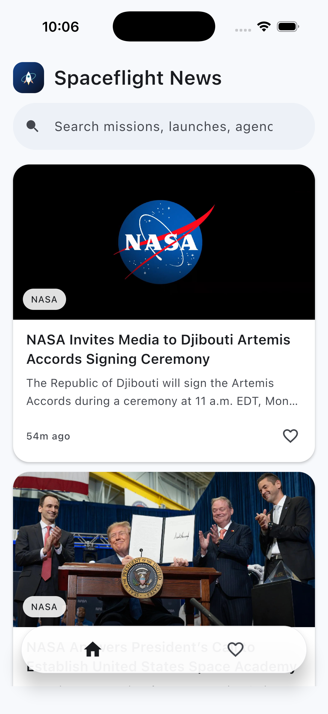

# Spaceflight News

[](https://github.com/emin-sengul/SpaceflightNews/actions/workflows/ci.yml)

[English](README.md) · **Türkçe**

[Spaceflight News API](https://api.spaceflightnewsapi.net/v4/docs/)'yi okuyan bir Kotlin
Multiplatform uygulaması. Android ve iOS her şeyi paylaşıyor — veri katmanı, domain ve Compose
Multiplatform arayüzü. Her platform yalnızca kendi giriş noktasını ve birkaç `actual` tanımını
sağlıyor.

<p align="center">
  
</p>

<p align="center"><em>iOS'ta çalışırken. Bu ekran görüntüsünü CI alıyor: bir macOS sunucusu Xcode
projesini derliyor, uygulamayı simülatöre kuruyor, açıyor ve ekranı yakalıyor.</em></p>

## Ne yapıyor

- Güncel makaleleri sonsuz kaydırmayla listeler
- API üzerinde tam metin arama
- Detay ekranı, paylaşma ve kaynağa gitme
- Önbellek silinse bile kaybolmayan, çevrimdışı açılan favoriler
- Offline-first: önbellekteki akış anında gösterilir, ağ arka planda tazeler
- Tablet ve geniş pencerelerde iki panelli yerleşim

## Nasıl çalıştırılır

**Android** — projeyi Android Studio'da açıp `androidApp` yapılandırmasını çalıştır, ya da:

```
./gradlew :androidApp:assembleDebug
```

**iOS** — `iosApp/iosApp.xcodeproj` dosyasını Xcode'da açıp çalıştır. Kotlin framework'ü Xcode
projesinin içindeki bir Gradle adımıyla derleniyor, ayrıca bir şey yapman gerekmiyor.

**Testler** (35 adet, hepsi `commonTest` içinde olduğu için iki platformda da koşuyor):

```
./gradlew allTests                 # tüm hedefler
./gradlew iosSimulatorArm64Test    # iOS simülatöründe
```

CI şunları yapıyor: Android derlemesi, iOS framework'leri (simülatör ve gerçek cihaz), ortak
testlerin iOS simülatöründe koşturulması ve çalışan uygulamanın ekran görüntüsünün alınması.

## Mimari

```
androidApp ──┐
             ├── shared ── feature:articles ─┐
iosApp ──────┘              feature:detail   ├── core:ui ── core:designsystem
                            feature:favorites┘       └───── core:domain
                                                              │
                      core:data ── core:network ──────────────┤
                          │        core:database              │
                          └────────core:common ───────────────┘
```

Bağımlılık kuralı tek yönlü: feature'lar domain'i bilir, veri katmanını asla görmez. Hem Ktor'u hem
Room'u bilen tek modül `core:data` ve o da uygulama sınırında Koin ile bağlanıyor — böylece üst
katmanlardaki hiçbir kod bir DTO'ya ya da entity'ye erişemiyor.

| Modül | Sorumluluğu |
| --- | --- |
| `core:common` | `DataResult`, `AppError`, dispatcher'lar ve ortak extension fonksiyonları |
| `core:domain` | `Article`, repository arayüzü, use case'ler — saf Kotlin, framework yok |
| `core:network` | Ktor istemcisi, DTO'lar, hata eşlemesi |
| `core:database` | Room entity'leri, DAO'lar, platforma özgü veritabanı kurucuları |
| `core:data` | Offline-first repository ve üç temsil arasındaki mapper'lar |
| `core:designsystem` | Tema, marka paleti, durumsuz bileşenler, modifier'lar |
| `core:ui` | Domain modelini bilen bileşenler, örneğin makale liste öğeleri |
| `feature:*` | Her biri bir ekran: state, intent, ViewModel, composable'lar |
| `shared` | Navigasyon grafiği, scaffold, tab bar, DI kurulumu |

### Açıklanmaya değer kararlar

**Offline-first ve tek doğruluk kaynağı olarak veritabanı.** Arayüz ağı hiç dinlemiyor; Room'u
dinliyor, ağ ise yalnızca Room'a yazıyor. Akışın soğuk açılışta anında görünmesinin sebebi bu. Bir
yenileme başarısız olduğunda ekranın bozulmamasının sebebi de bu: hata, duran içeriğin üstünde bir
şerit olarak beliriyor, içeriğin yerine geçmiyor.

**Favoriler kendi tablosunda, makalenin tam kopyasıyla saklanıyor.** Akla ilk gelen tasarım,
önbellekteki makaleye bir boolean sütun eklemek. Bu, akış her yenilendiğinde kırılıyor: ilk sayfadan
düşen makale önbellekten siliniyor ve favori de onunla birlikte kayboluyor. Makalenin tamamını
`favorite_articles` tablosuna kopyalamak biraz veri tekrarına mal oluyor ama karşılığında favoriler
kalıcı oluyor ve çevrimdışı açılıyor. İki tablo sütun tanımlarını `@Embedded ArticleColumns`
üzerinden paylaşıyor.

**Arama sonuçları bilinçli olarak hiç önbelleğe yazılmıyor.** Arama doğrudan API'ye gidiyor, favori
durumu bellekte birleştiriliyor. Sonuçları akış önbelleğine yazmak, kronolojik olması gereken bir
akışa filtrelenmiş bir sonuç kümesini karıştırmak olurdu.

**Her feature'da MVI.** Tek bir değişmez `UiState`, tek bir `Intent` sealed interface'i, tek bir
`StateFlow`. ViewModel state'i `stateInWhileSubscribed` ile yayınlıyor; ekran arka plana geçtiğinde
dinleme duruyor, geri dönüldüğünde veri yeniden çekilmeden kaldığı yerden devam ediyor.

**Kaynak kodda hiç yorum satırı yok.** Açıklamayı isimler, küçük fonksiyonlar ve bu dosya taşıyor.
Bu işin önemli bir kısmını extension fonksiyonları yapıyor — `article.sourceUrl`,
`state.emptyTitle()`, `loadState.update(FeedLoadState::refreshing)` — her biri aksi halde yorum
gerektirecek bir satırın yerine geçiyor.

### Uygulamanın değil, API'nin sınırı

Case, detay ekranında makalenin tam metnini istiyor. Spaceflight News API bunu döndürmüyor. Her
makalede `title`, `summary`, `image_url`, `news_site`, `published_at`, `authors` ve özgün yayıncıya
giden bir `url` var — hiçbir uçta gövde metni alanı yok.

Ekranı doldurmak ya da yayıncının sayfasını kazımak yerine detay ekranı API'nin verdiği her şeyi
gösteriyor ve "Read the full story on {kaynak}" ile tarayıcıya devrediyor. Kazıma hem kırılgan hem
hukuken tartışmalı olurdu, üstelik yayıncının kendi sayfasından daha kötü bir deneyim sunardı.

## Teknolojiler

Kotlin 2.4.10 · Compose Multiplatform 1.12.0 · AGP 9.3.0 · Gradle 9.7.1 · minSdk 24 · compileSdk 37

Ktor 3.5.2 (Android'de OkHttp, iOS'ta Darwin) · Room 2.8.4, paketlenmiş SQLite sürücüsüyle ·
Koin 4.2.2 · kotlinx-serialization · kotlinx-coroutines · kotlinx-datetime · görseller için Coil 3 ·
tip güvenli rotalarla Navigation Compose · Flow testleri için Turbine

### Performans tarafında

`@Immutable` state sınıfları, her liste öğesinde kararlı `key` ve `contentType`, eklemeler için
`animateItem()`, satır başına biçimlendirmenin ve listeye geçilen her callback'in `remember` içine
alınması, kaydırma takibi için recomposition yerine `snapshotFlow`. Geç yüklenen görseller
`SubcomposeAsyncImage` üzerinden shimmer gösteriyor; Coil ikinci bir HTTP yığını açmak yerine
uygulamanın Ktor istemcisini paylaşıyor.

## Kaynak gösterimi

Makale verileri [The Space Devs](https://thespacedevs.com/) tarafından sağlanan
[Spaceflight News API](https://api.spaceflightnewsapi.net/v4/docs/)'den geliyor. Kaynak gösterimi
uygulama içinde de yer alıyor: açılış ekranında ve her iki listenin sonunda.
